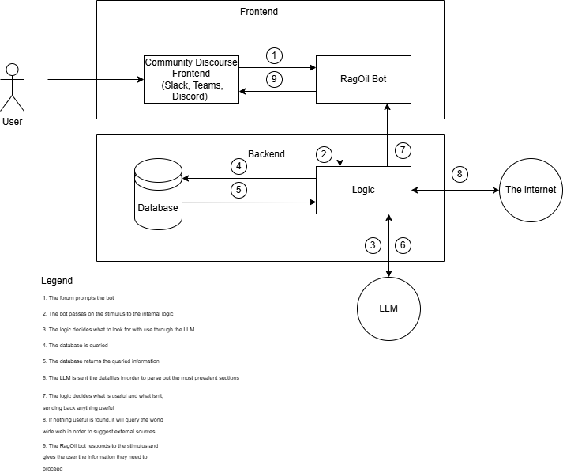

# System Block Diagram

## Description

The flow of this project starts with the user interacting with a frontend of some kind like Slack, MS Teams, or Discord. Then, through that frontend, the user is able to interact with the RagOil bot. This bot interacts heavily with an LLM (Large Language Model) in order to supply information that the user is interested in. The logic connects it to a database specific to the organization that is using the frontend. This database is where the organization specific data and files are located - files such as notes on common tools or completed projects that the team has worked with. It also has a subsection that holds information that the RagOil project knows about its users: information about seniority and a suspected knowledge base that the bot can then use to help build bridges between coworkers and reference them to each other. Then, the LLM is fed the important documents in a RAG (Retrieval Augmented Generation) fashion in order to reduce the amount of hallucinations made by the LLM. If the information in the database is insufficient, it may look to the internet in order to find papers and documentation that might help the user instead. Then, the information collected by the RagOil bot is sent through the frontend to the user. 

