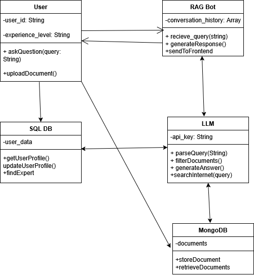

# Class Diagrams

## Overview

The class diagram shows the main components and their interactions in Project Keystone. The system is composed of User, RAG Bot, SQL_DB, LLM, and MongoDB.

## Component Descriptions

### User

The person interacting with the system.
**Attributes:**
* `-user_id: String` - Unique identifier for the user
* `-experience_level: String` - User's expertise level

**Methods:**
* `+askQuestion(query: String)` - Submits a question to the bot
* `+uploadDocument()` - Uploads new files to the system

### RAG Bot

Receives queries from users and orchestrates the response generation.

**Attributes:**
* `-conversation_history: Array` - Maintains context across interactions

**Methods:**
* `+recieve_query(string)` - Accepts the user's question
* `+generateResponse()` - Creates answer using retrieved documents and LLM
* `+sendToFrontend` - Delivers formatted response back to user

### LLM (Large Language Model)

Generates natural language responses based on retrieved documents.

**Attributes:**
* `-api_key: String` - Authentication for LLM API

**Methods:**
* `+parseQuery(String)` - Understands the user's intent
* `+filterDocuments()` - Identifies relevant information from retrieved docs
* `+generateAnswer()` - Creates context-aware responses
* `+searchInternet(query)` - Searches external sources if internal docs insufficient

### MongoDB

Stores documents, files, and their content for retrieval.

**Technology:** MongoDB

**Attributes:**
* `-documents: Collection` - Uploaded files and documentation

**Methods:**
* `+storeDocument` - Adds new documents to the database
* `+retrieveDocuments` - Fetches relevant documents based on query

### SQL_DB

Stores user profile information and interaction history.

**Technology:** PostgreSQL/MySQL

**Attributes:**
* `-user_data: Table` - User profiles and experience levels

**Methods:**
* `+getUserProfile()` - Retrieves user information
* `+updateUserProfile()` - Tracks interactions and learning progress
* `+findExpert` - Suggests team members with specific expertise
## Key System Features

* Query Processing

* Document Retrieval

* Response Generation

* User Profile Management

* Expert Matching

* Fallback Search

* Conversation Context

  
