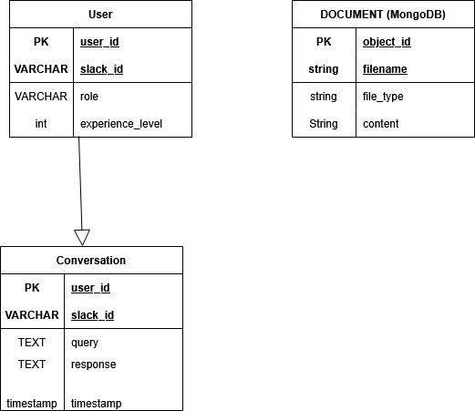

# Database Design

## Entity-Relationship Diagram

## Database Overview

The system uses **two databases**:
- **SQL Database** (PostgreSQL/MySQL) - Stores users and conversations
- **NoSQL Database** (MongoDB) - Stores documents and their content

---

## Entities

### User (SQL)
Stores user profile and role information.

| Column | Type | Key | Description |
|--------|------|-----|-------------|
| user_id | VARCHAR | PK | Unique user identifier |
| slack_id | VARCHAR | | Slack user ID |
| role | VARCHAR | | User role (user/admin) |
| experience_level | INT | | User's experience level |

### Conversation (SQL)
Stores chat history between users and the bot.

| Column | Type | Key | Description |
|--------|------|-----|-------------|
| user_id | VARCHAR | PK | User identifier |
| slack_id | VARCHAR | | Slack user ID |
| query | TEXT | | User's question |
| response | TEXT | | Bot's response |
| timestamp | TIMESTAMP | | When conversation occurred |

### Document (MongoDB)
Stores uploaded documents and files.

| Field | Type | Key | Description |
|-------|------|-----|-------------|
| _id | ObjectId | PK | Unique document identifier |
| filename | String | | Original file name |
| file_type | String | | File type (pdf, docx, txt) |
| content | String | | Full text content |

